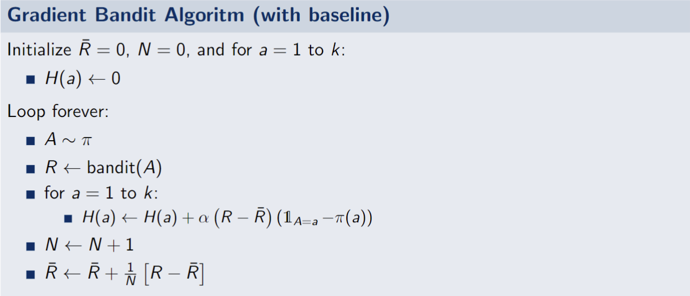

# Bandits :slot_machine:
Code for the first assignment of the course IIC3675 - Reinforcement Learning

## Experiment replication :test_tube:
To replicate reported plots, first clone this repo and then run `Main.py` as follows:

```bash
python Main.py
```
Depending on your Python installation, this may vary `python` to `python3`.

At first the program will ask you to select the experiment to replicate, giving three options: **Epsilon Greedy**, **Optimistic Initial Values** and **Gradient Bandit**. Once you have selected an experiment, it will execute 2000 runs with a 1000 steps each. Finally, the program will ask you the names you want to give to the generated plots, which will be saved on the `imgs/` folder.

> [!WARNING]
> The **Gradient Bandit** experiment takes considerably more execution time than the other two. To give you a perspective, a **Gradient Bandit** execution takes about two minutes while the others take about 15 seconds.

Below is a reference of what you should get by selection each option.

### Epsilon Greedy  (from book Fig. 2.2)

First, you will have to name the average rewards plot, which should look like this:


%20average_rewards.png)

Then, the program will ask you the name for the optimal action percentage plot, which should be similar to the following:


%20optimal_action_percentage.png)

### Optimistic Initial Values (from book Fig. 2.3)

The generated plot for this experiment should be looking like this:


%20optimal_action_percentage.png)
### Gradient Bandit (from book Fig. 2.5)

An important aspect to mention is that the implementation has some difference with the version from class, which has the following pseudocode:



However, our implementation updates the baseline ($\bar{R}$) and then learns (updates $H$). This was done following the footnote on pg. 37 of the book which says: "In the empirical results in this chapter, the baseline $\bar{R}_t$ also included $R_t$".

For more details please check the [GradientBandit.py](https://github.com/pedropalmav/RL-T1/blob/main/algorithms/GradientBandit.py) file and also the report included for the assignment.


The generated plot should be similar to this:

%20optimal_action_percentage.png)

> [!NOTE]
> The blue and green curves are the methods with baseline, whereas the orange and red are the methods without baseline.